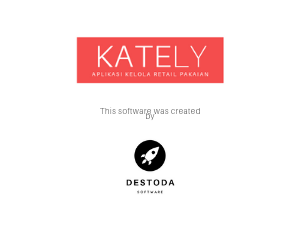

# Kately API
Kately API merupakan interface yang digunakan untuk mengintegrasikan beberapa aplikasi Kately lainnya (`Kately Office`).

**Tentang Kately**
Sebuah software kelola ritel (khususnya untuk ritel brand pakaian) yang dapat membantu anda mengelola transaksi
penjualan di store. Dengan bantuan Kately, anda bisa mengelola banyak aktivitas ritel yang sebelumnya
biasa Anda kerjakan sendiri.



## Prasyarat
- Python 3.6+
- Django 2.2+

## Setup
Anda perlu menginstal beberapa package yang diperlukan:

```
$ pip install -r requirements.txt
```

**Konfigurasi**
Jika Anda ingin mengubah konfigurasi lainnya, Anda bisa melakukannya pada file `config/settings.py`.

**Migrasi**
Jalankan perintah berikut untuk menjalankan migrasi:

```
$ python manage.py migrate
```

**Menjalankan Development Server**
Setelah semuanya selesai, Anda bisa langsung menjalankan development server dengan mengetik perintah:

```
$ python manage.py runserver
```

## Dokumentasi
Ketika development server sudah berjalan, Anda bisa memulai playground API yang tersedia:

```
http://localhost:8000/office/
```

## Lisensi

```
Copyright (c) 2019 Destoda Software

Permission is hereby granted, free of charge, to any person obtaining a copy
of this software and associated documentation files (the "Software"), to deal
in the Software without restriction, including without limitation the rights
to use, copy, modify, merge, publish, distribute, sublicense, and/or sell
copies of the Software, and to permit persons to whom the Software is
furnished to do so, subject to the following conditions:

The above copyright notice and this permission notice shall be included in all
copies or substantial portions of the Software.

THE SOFTWARE IS PROVIDED "AS IS", WITHOUT WARRANTY OF ANY KIND, EXPRESS OR
IMPLIED, INCLUDING BUT NOT LIMITED TO THE WARRANTIES OF MERCHANTABILITY,
FITNESS FOR A PARTICULAR PURPOSE AND NONINFRINGEMENT. IN NO EVENT SHALL THE
AUTHORS OR COPYRIGHT HOLDERS BE LIABLE FOR ANY CLAIM, DAMAGES OR OTHER
LIABILITY, WHETHER IN AN ACTION OF CONTRACT, TORT OR OTHERWISE, ARISING FROM,
OUT OF OR IN CONNECTION WITH THE SOFTWARE OR THE USE OR OTHER DEALINGS IN THE
SOFTWARE.
```
